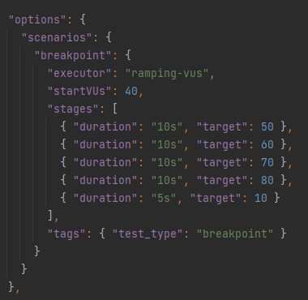

# Breakpoint Configuration Pattern

The aim of breakpoint testing (also known as capacity testing) is to determine the maximum possible load before 
some criterias (thresholds) can not be met.

You can run a breakpoint test by setting the property `test.breakpoint` to true.
The load test will then rerun with increased load after it´s finished. 
This will continue until a threshold is not met or the maximum amount of loops are reached.

Breakpoint tests should be configured like a stress test.
See here for more information about stress testing: https://k6.io/docs/test-types/stress-testing/

## Pattern

Please follow this pattern when using breakpoint testing.

Inside `options` there has to be a `scenarios` key.

Inside `scenarios` there has to be a `breakpoint` key, which includes the breakpoint scenario. 
You can also add other scenarios.

Inside `breakpoint` there has to be a `stages` key. 
Here you can add as many stages as you want inside the array.
One stage always consists of a `duration` and a `target`.

[See here for more information about the load test configuration in general](TestConfiguration.md)