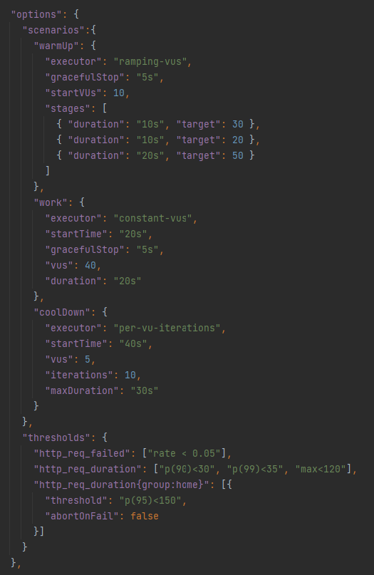

# Test Configuration Documentation

To create k6 load tests, you need to write a configuration in form of a JSON file.
Every configuration needs the following keys:
- `baseURL`
- `options`
- `requests`

See below for further explanation.

You can view an **example configuration** [here](../src/main/resources/config/grafanaConfig.json).

---
## baseURL

The key `baseURL` requires a **String** as value.

All requests will use the `baseURL` at the beginning for their endpoint.
Specific path endings can be added in the particular request.
If you don´t want to use a baseURL, please use an empty String (`""`) instead.

---
## options

The key `options` requires a **JSONObject** as value.

With the k6 options you can configure your load test in detail. You can specify
how many virtual users (vus) should be created, several durations, thresholds, stages, scenarios and more.
You can find detailed information for every configuration option here: https://k6.io/docs/using-k6/k6-options/reference/

It is possible to use an empty JSONObject (`{}`) for the default options (1 vu, 10,5 min maxDuration)

The `options` JSONObject can be passed directly to k6 which makes the parsing of the configuration very easy.

---
## requests

The key `requests` requires a **JSONArray** as value.

Inside the array you can create a JSONObject for every request. Each request needs the following keys:

- `type`
- `path`

Currently, you can use `GET`, `POST`, `PUT` and `DELETE` as values for `type`.

The `path` value will be added to the previous set `baseURL`. If you don´t need a path for a request,
please use an empty String (`""`) instead.

Additionally, you can add the following keys to each request:

- `payload`
- `params`
- `checks`

#### payload

The key `payload` requires a **JSONObject** as value.

Here you can add any model that should be sent to an endpoint.

#### params

The key `params` requires a **JSONObject** as value.

Here you can add additional information for your request like `headers`, `tags` or `cookies`.
If you´ve used tags in `options`, you can add them here when necessary.
You can find more information about k6 params: https://k6.io/docs/javascript-api/k6-http/params/

#### checks

The key `checks` requires a **JSONObject** as value.

Here you can evaluate your request after it´s finished for specific properties like 
the response `status`, `body` or `error code`.
You can find all implemented k6 checks [here](../README.md#implemented-features).

Unlike thresholds, `checks` can **not** stop the current test. They rather help developers/users to examine the test results.
If you want to stop the test after certain criterias, please use [thresholds](https://k6.io/docs/using-k6/thresholds/)
in `options`. You can examine the check results in the generated output.

#### Example for a complete request array

---
## Additional Information

It is recommended to use a `name` or `description` key at the top of the file to provide quick information 
about the configuration.

With k6 you can also create other types of tests than load tests.
View all possible test types of k6 here: https://k6.io/docs/test-types/